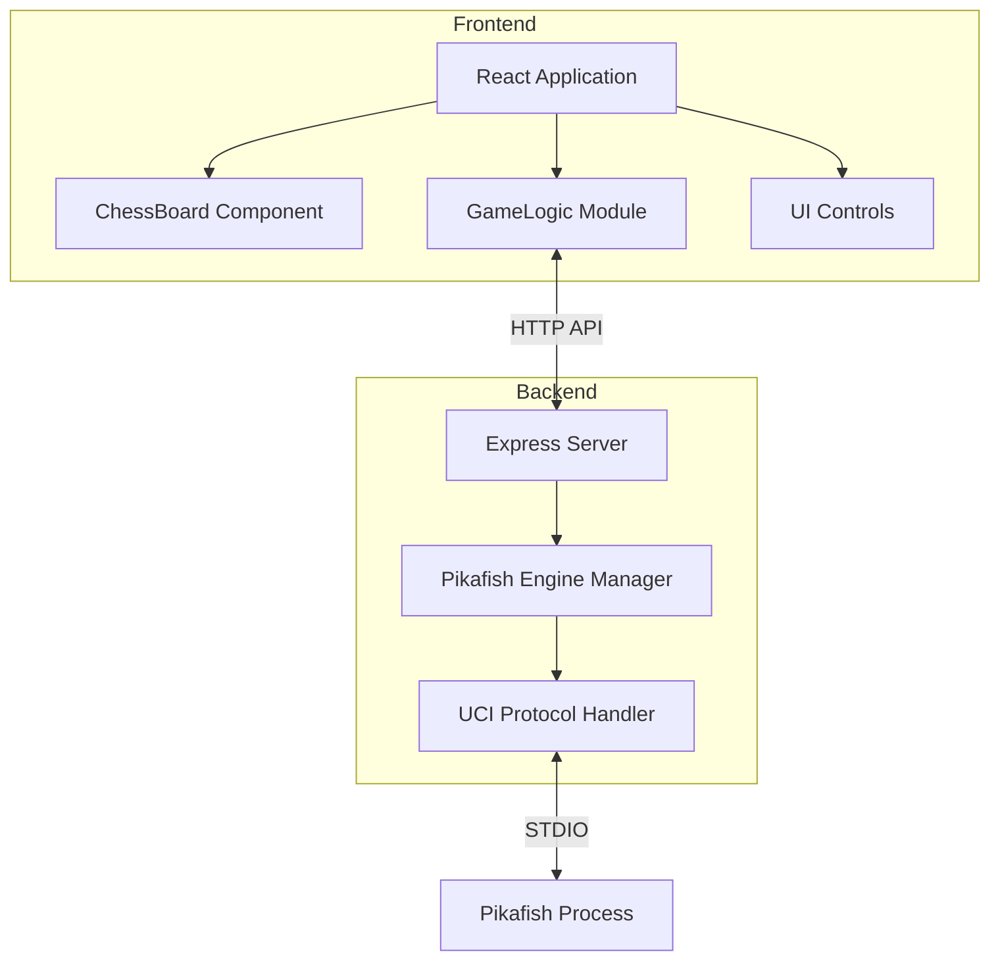

## 1. 架构设计



## 2. 技术描述
- **前端**：React@18 + TypeScript + TailwindCSS + Vite
- **初始化工具**：vite-init
- **后端**：Express@4 + TypeScript
- **通信**：前端通过 REST API 与后端通信，后端通过 STDIO 与 Pikafish 引擎通信

## 3. 路由定义

### 前端路由
| 路由 | 页面名称 | 说明 |
|-------|---------|-----|
| / | 游戏主页 | 中国象棋游戏主界面 |

### 后端 API 路由
| 路由 | 方法 | 说明 |
|-------|------|-----|
| /api/engine/start | POST | 启动 Pikafish 引擎 |
| /api/engine/stop | POST | 停止 Pikafish 引擎 |
| /api/engine/move | POST | 发送当前局面，请求最佳走法 |
| /api/engine/setoption | POST | 设置引擎选项 |

## 4. API 定义

### 类型定义
```typescript
// 棋子类型
type PieceType = 'general' | 'advisor' | 'elephant' | 'horse' | 'chariot' | 'cannon' | 'soldier';
type PieceColor = 'red' | 'black';

// 棋子
interface Piece {
  type: PieceType;
  color: PieceColor;
  position: Position;
}

// 位置
interface Position {
  x: number; // 0-8
  y: number; // 0-9
}

// 走法
interface Move {
  from: Position;
  to: Position;
  piece: Piece;
  captured?: Piece;
}

// 游戏状态
interface GameState {
  board: (Piece | null)[][];
  currentTurn: PieceColor;
  history: Move[];
  gameMode: 'pvp' | 'pve' | 'setup';
  isGameOver: boolean;
  winner?: PieceColor;
}

// AI 请求
interface AiRequest {
  fen: string; // FEN 格式的局面
  depth?: number;
  time?: number;
}

// AI 响应
interface AiResponse {
  move: string; // UCI 格式走法，如 "h2e2"
  evaluation?: number;
  depth?: number;
}
```

### API 端点
```typescript
// POST /api/engine/move
// Request: { fen: string, depth?: number }
// Response: { move: string, evaluation?: number }

// POST /api/engine/start
// Response: { success: boolean, engineId: string }

// POST /api/engine/stop
// Response: { success: boolean }
```

## 5. 数据结构设计

### 棋盘表示
```typescript
// 9x10 棋盘
type Board = (Piece | null)[][]; // board[y][x]

// 初始局面
const initialBoard: Board = [
  // 0-4: 黑方（上方）
  [
    { type: 'chariot', color: 'black', position: { x: 0, y: 0 } },
    { type: 'horse', color: 'black', position: { x: 1, y: 0 } },
    { type: 'elephant', color: 'black', position: { x: 2, y: 0 } },
    { type: 'advisor', color: 'black', position: { x: 3, y: 0 } },
    { type: 'general', color: 'black', position: { x: 4, y: 0 } },
    { type: 'advisor', color: 'black', position: { x: 5, y: 0 } },
    { type: 'elephant', color: 'black', position: { x: 6, y: 0 } },
    { type: 'horse', color: 'black', position: { x: 7, y: 0 } },
    { type: 'chariot', color: 'black', position: { x: 8, y: 0 } },
  ],
  [null, null, null, null, null, null, null, null, null],
  [
    null,
    { type: 'cannon', color: 'black', position: { x: 1, y: 2 } },
    null, null, null, null, null,
    { type: 'cannon', color: 'black', position: { x: 7, y: 2 } },
    null,
  ],
  [
    { type: 'soldier', color: 'black', position: { x: 0, y: 3 } },
    null,
    { type: 'soldier', color: 'black', position: { x: 2, y: 3 } },
    null,
    { type: 'soldier', color: 'black', position: { x: 4, y: 3 } },
    null,
    { type: 'soldier', color: 'black', position: { x: 6, y: 3 } },
    null,
    { type: 'soldier', color: 'black', position: { x: 8, y: 3 } },
  ],
  // 5-9: 红方（下方）
  [null, null, null, null, null, null, null, null, null],
  [null, null, null, null, null, null, null, null, null],
  [
    { type: 'soldier', color: 'red', position: { x: 0, y: 6 } },
    null,
    { type: 'soldier', color: 'red', position: { x: 2, y: 6 } },
    null,
    { type: 'soldier', color: 'red', position: { x: 4, y: 6 } },
    null,
    { type: 'soldier', color: 'red', position: { x: 6, y: 6 } },
    null,
    { type: 'soldier', color: 'red', position: { x: 8, y: 6 } },
  ],
  [
    null,
    { type: 'cannon', color: 'red', position: { x: 1, y: 7 } },
    null, null, null, null, null,
    { type: 'cannon', color: 'red', position: { x: 7, y: 7 } },
    null,
  ],
  [null, null, null, null, null, null, null, null, null],
  [
    { type: 'chariot', color: 'red', position: { x: 0, y: 9 } },
    { type: 'horse', color: 'red', position: { x: 1, y: 9 } },
    { type: 'elephant', color: 'red', position: { x: 2, y: 9 } },
    { type: 'advisor', color: 'red', position: { x: 3, y: 9 } },
    { type: 'general', color: 'red', position: { x: 4, y: 9 } },
    { type: 'advisor', color: 'red', position: { x: 5, y: 9 } },
    { type: 'elephant', color: 'red', position: { x: 6, y: 9 } },
    { type: 'horse', color: 'red', position: { x: 7, y: 9 } },
    { type: 'chariot', color: 'red', position: { x: 8, y: 9 } },
  ],
];
```

## 6. FEN 转换
需要实现中国象棋局面与 FEN 格式的互相转换，用于与 Pikafish 引擎通信。中国象棋的 FEN 格式与国际象棋类似但有区别。
