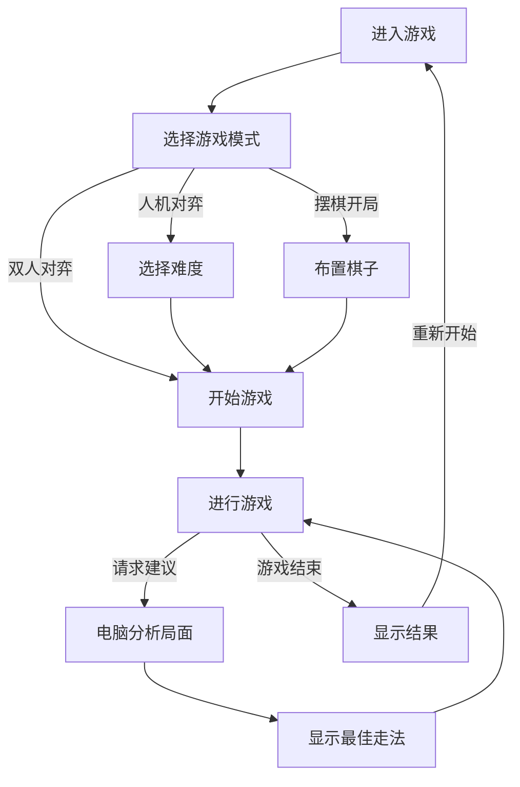

## 1. 产品概述
中国象棋人机大战游戏，提供美观的 H5 界面，支持双人对弈、人机对弈、摆棋开局，电脑可以随时介入给出最佳走法建议。
- 解决中国象棋爱好者的对弈需求，提供强大的 AI 对手功能，同时支持教学和练习功能
- 目标用户是中国象棋爱好者，无论是初学者还是高级玩家

## 2. 核心功能

### 2.1 用户角色
无复杂角色区分，所有用户都可以使用全部功能。

### 2.2 功能模块
1. **游戏页面**：棋盘展示、棋子交互、游戏控制
2. **设置面板**：游戏模式选择、难度调整、棋盘配置

### 2.3 页面详情
| 页面名称 | 模块名称 | 功能描述 |
|-----------|-------------|---------------------|
| 游戏页面 | 棋盘展示 | 9×10 中国象棋棋盘，美观的棋子和棋盘设计 |
| 游戏页面 | 走棋交互 | 点击选棋，点击落子，支持拖拽 |
| 游戏页面 | 游戏控制 | 开始新游戏、悔棋、撤销、重置 |
| 游戏页面 | 游戏模式 | 双人对弈、人机对弈、摆棋模式切换 |
| 游戏页面 | AI 介入 | 随时请求电脑分析和建议下一步走法 |
| 游戏页面 | 棋局信息 | 显示当前回合、历史走法、游戏状态 |

## 3. 核心流程
用户进入游戏后选择游戏模式，可以进行双人对弈、人机对弈或摆棋开局。在任何模式下，都可以随时请求电脑给出下一步走法建议。AI 会在后台通过 UCI 协议与 Pikafish 引擎通信，分析当前局面并返回最佳走法。

## 4. 用户界面设计
### 4.1 设计风格
- **主色调**：古典木纹色（#8B4513）搭配米黄色背景（#FFF8DC），营造传统棋盘氛围
- **辅助色**：红色（#DC143C）和黑色（#1a1a1a）代表双方棋子
- **按钮风格**：圆角矩形，带有微妙阴影，悬停时有放大效果
- **字体**：清晰易读的中文黑体或楷体，标题使用较大字号
- **布局风格**：传统对称布局，棋盘居中，控制面板在下方或侧边
- **图标风格**：中式传统纹样或简洁的现代图标

### 4.2 页面设计概述
| 页面名称 | 模块名称 | UI Elements |
|-----------|-------------|-------------|
| 游戏页面 | 棋盘 | 9×10 网格，木质纹理背景，楚河汉界分隔 |
| 游戏页面 | 棋子 | 圆形棋子，红黑两色，清晰的汉字标识 |
| 游戏页面 | 控制面板 | 模式切换按钮、操作按钮、信息显示区 |
| 游戏页面 | 历史记录 | 走法记录列表，可点击回顾 |
| 游戏页面 | AI 建议 | 高亮显示推荐走法，动画效果 |

### 4.3 响应式
移动优先设计，棋盘自适应屏幕大小，在小屏幕上优化触控体验，按钮大小适合手指点击。

### 4.4 动画与交互
- 棋子移动时有平滑过渡动画
- 选中状态有高亮效果
- AI 思考时有加载动画
- 胜利/失败时有庆祝动画
